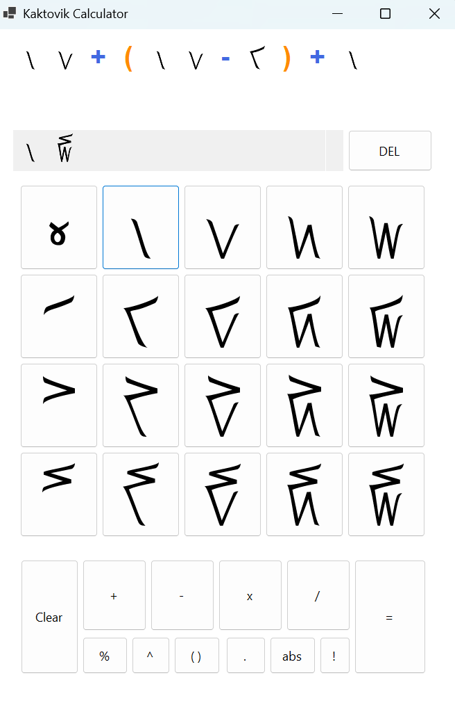

# 🔢 Kaktovik Calculator
A specialized Windows desktop application designed to perform mathematical operations using the **Kaktovik numeral system**. This project was built to explore base-20 (vigesimal) logic and custom UI implementation in the .NET environment.

 > The Kaktovik numerals or Kaktovik Iñupiaq numerals[1] are a base-20 system of numerical digits created by Alaskan Iñupiat. They are visually iconic, with shapes that indicate the number being represented.
 
 (From Wikipedia)
## 🌟 Features
- **Base-20 Logic:** Fully functional arithmetic tailored to the Iñupiaq numeral system.
- **Lightweight & Portable:** Run the application without a complex installer.
## 🛠️ Built With

- **Language:** Visual Basic .NET 
- **Framework:** .NET
- **IDE:** Visual Studio 2026

## 📥 Installation & Usage
1. Go to the **[Releases]** section on the right side of this GitHub page.
2. Download the `Kaktovik_Calculator.zip` file.
3. Extract the folder and run `Kaktovik Calculator.exe`. 
	- Note: As this is an unsigned educational project, Windows SmartScreen may show a warning. Click "More Info" -> "Run Anyway" to proceed.
## Screenshot

- Base 10 : $22+16+1=39$
- Base 20 : $(1×20^1)+(19×20^0)=20+19=39$ = $1J$ in Base20
## Documents
- https://en.wikipedia.org/wiki/Kaktovik_numerals
- https://www.dcode.fr/kaktovik-numerals
